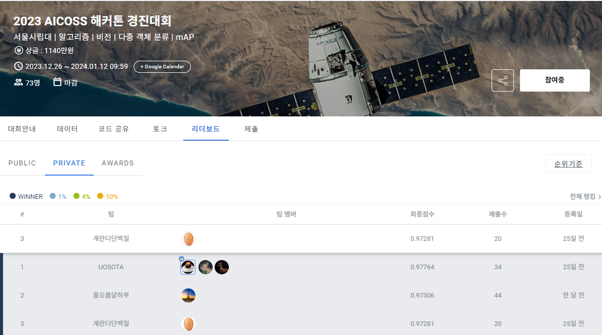

# 2023 AICOSS DACON CONTEST public/private/final 5th/3th/4th Code

This repository contains code in 2023 AICOSS Dacon code.

you can install my env by using following command.

<pre>
<code>
git clone https://github.com/dokyung36d/2023-AICOSS.git
cd 2023-AICOSS/
conda env create -f env.yaml
</code>
</pre>

After setting environment, you need to download DaVit pretrained model in following URL.

Source of the Pre-trained model is DaVit offical Github.
you can visit this repository by [Click this](https://github.com/dingmyu/davit/tree/main)

you should download the Pre-trained model by [Click this](https://connecthkuhk-my.sharepoint.com/personal/u3007305_connect_hku_hk/_layouts/15/onedrive.aspx?id=%2Fpersonal%2Fu3007305%5Fconnect%5Fhku%5Fhk%2FDocuments%2FCodes%2F22%5FCVPR%5FDaViT%2Fbase%2Fmodel%5Fbest%2Epth%2Etar&parent=%2Fpersonal%2Fu3007305%5Fconnect%5Fhku%5Fhk%2FDocuments%2FCodes%2F22%5FCVPR%5FDaViT%2Fbase&ga=1)

you need to place downloaded Pre-trained model in the same directory to run the AICOSS_2023_main_EggTheProtein_final.ipynb file.

## Total Result
